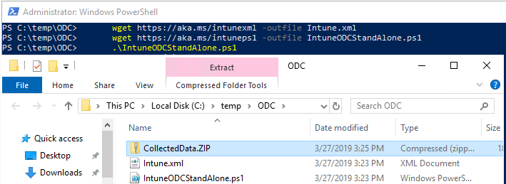

# Customer-ready email template

1. Please download the IntuneODCStandAlone.ps1 file from [this link](https://raw.githubusercontent.com/markstan/IntuneOneDataCollector/master/IntuneODCStandAlone.ps1) (right-click and choose "save as..." in IE and Chrome; Edge users should copy all text to a plain text file and save as 'IntuneODCStandAlone.ps1'). 
The script will attempt to automatically download its data collection settings.  If you encounter problems during this phase, you can also manually download Intune.XML from  [this link](https://raw.githubusercontent.com/markstan/IntuneOneDataCollector/master/Intune.xml) and place it in the same folder as IntuneODCStandAlone.ps1. 

1. Open an **elevated** PowerShell window by right-clicking on your PowerShell shortcut and choosing 'Run as Administrator'

1. In the PowerShell window, navigate to the folder where you downloaded IntuneODCStandAlone.ps1 and type the command **.\IntuneODCStandAlone.ps1**

1. Wait for the script to complete. It will take some time (2-3 minutes typically).

1. An Explorer window will open in your download directory.  Please upload the CollectedData.zip file to the Microsoft secure file transfer site provided to you.

**Hint**: You can download both files and run the collector quickly using these PowerShell commands: 

             wget https://aka.ms/intunexml -outfile Intune.xml
             wget https://aka.ms/intuneps1 -outfile IntuneODCStandAlone.ps1
             .\IntuneODCStandAlone.ps1
 
